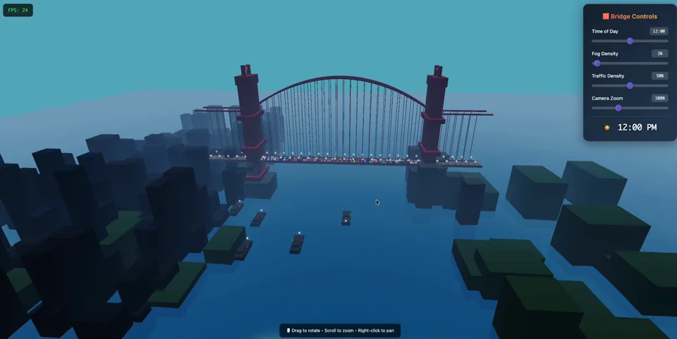

# OpenGame Showcases

Public browser-game showcases and installable creator skills from
[OpenGame](https://opengame.app/).

**Website:** https://opengame.app/

## Featured preview

**Golden Gate Bridge — 3D Cinematic**

Click the poster to play the live demo, or watch the [video preview](https://cdn.ai-game-generator.com/public/golden_gate_bridge.mp4).

This repository is intentionally small. It contains public showcase material only: playable static HTML examples, prompts, and links to the matching OpenGame pages. It does **not** contain OpenGame production runtime code, deployment configuration, credentials, user data, billing data, or analytics exports.

## Showcases

| Showcase | Type | Play | Video | Prompt | OpenGame page |
| --- | --- | --- | --- | --- | --- |
| [Golden Gate Bridge — 3D Cinematic](showcases/golden-gate-bridge/) | 3D / Three.js / WebGL | [Live demo](https://opengame.app/games/golden_gate_bridge.html) | [Video preview](https://cdn.ai-game-generator.com/public/golden_gate_bridge.mp4) | [Prompt](prompts/golden-gate-bridge.md) | [OpenGame page](https://opengame.app/games/golden-gate-bridge) |
| [Vaporwave Platformer — Night City](showcases/vaporwave-platformer/) | 2D / Platformer / Canvas | [Live demo](https://opengame.app/games/vaporwave-platformer.html) | — | [Prompt](prompts/vaporwave-platformer.md) | [OpenGame page](https://opengame.app/games/vaporwave-platformer) |

## Run locally

Open the HTML files directly in a browser:

~~~bash
open showcases/golden-gate-bridge/index.html
open showcases/vaporwave-platformer/index.html
~~~

The Golden Gate Bridge showcase imports Three.js from jsDelivr. The Vaporwave Platformer is self-contained.

## Install OpenGame Skills

This repository is the canonical source for public OpenGame skills. Install the
current catalog with:

~~~bash
npx skills add opengameapp/OpenGame-showcases \
  --skill opengame-browser-game-builder
~~~

| Skill | What it does |
| --- | --- |
| [OpenGame Browser Game Builder](skills/opengame-browser-game-builder/) | Turns an idea into an original, focused playable browser-game plan or prototype. |

See [skills/README.md](skills/README.md) for the catalog and
[docs/skill-publishing.md](docs/skill-publishing.md) for the versioned release
process. The first skill is source-ready; it has not yet been published to
ClawHub.

## Remix with OpenGame

Use the prompt files in `prompts/` as starting points, then remix them with OpenGame on the official website:

- [OpenGame homepage](https://opengame.app/)

- [AI Game Maker](https://opengame.app/ai-game-generator/ai-game-maker)
- [AI Game Agent](https://opengame.app/games/ai-game-agent)
- [3D browser games](https://opengame.app/games/3d)

## Repository scope

Included:

- Public playable HTML showcases.
- Original prompts used to guide generation.
- Public, installable game-development skills.
- Links to matching OpenGame live demos and detail pages.

Not included:

- Proprietary OpenGame app/runtime source.
- Production secrets, API keys, cookies, user records, analytics, payments, or deployment config.
- Private prompts or customer-generated content.

## License

MIT for the showcase material in this repository. Third-party runtime libraries loaded by examples remain under their own licenses.

## Contact

Product support: support@opengame.app  
General contact: hello@opengame.app
